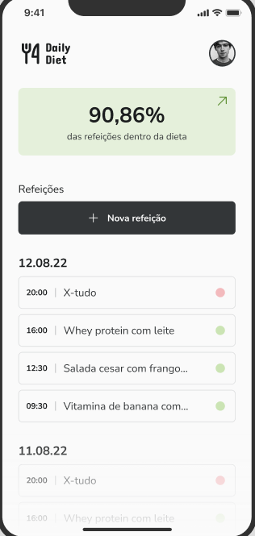

# Daily Diet

---

---

## Sobre

> Essa é uma aplicação simples desenvolvida em React Native, que permite a criação de listas de refeições e a visualização da porcentagem de alimentos saudáveis e não saudáveis consumidos, além de exibir a sequência máxima de alimentos saudáveis consumidos. Para armazenar esses dados, foi utilizada a biblioteca AsyncStorage, que permite o armazenamento assíncrono na memória do dispositivo.
---

## Referência

**Rocketseat**

[Desafio 02](https://efficient-sloth-d85.notion.site/Desafio-02-Daily-Diet-98b7d85ec7e9428aa0f9f3bceed4380f)

[Layout](https://www.figma.com/file/rl8tiMCLinxmXm1ycU2MFg/Daily-Diet-(Community)?type=design&node-id=0-1)

---

## Dependências

- Node.js(LTS);
- npm;
- expo-cli;
- AsyncStorage;
- Expo GO.

---

## Dispositivos Virtuais

- Emulador Android: **Android Studio**
- iOS Simulator: **XCode**

---

## Configuração do Ambiente

> Faça uma cópia do projeto:

ssh
~~~
$ git clone git@github.com:haruoSugano/daily-diet.git
~~~

https
~~~
$ git clone https://github.com/haruoSugano/daily-diet.git
~~~

---

> Baixe as dependências:

Acesse a pasta todo-list
~~~
$ cd daily-diet
~~~

Digite o comando:
~~~
$ npm install
~~~

---

> Execução:

~~~
$ expo start
~~~ 

Para Android digite:
~~~
$ a
~~~